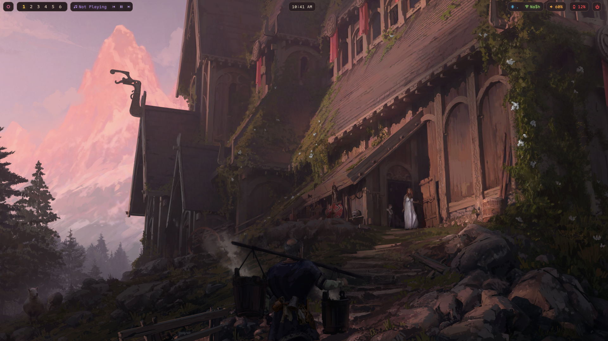
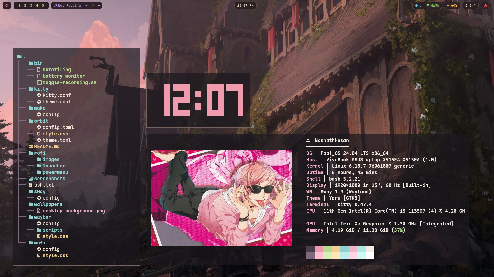
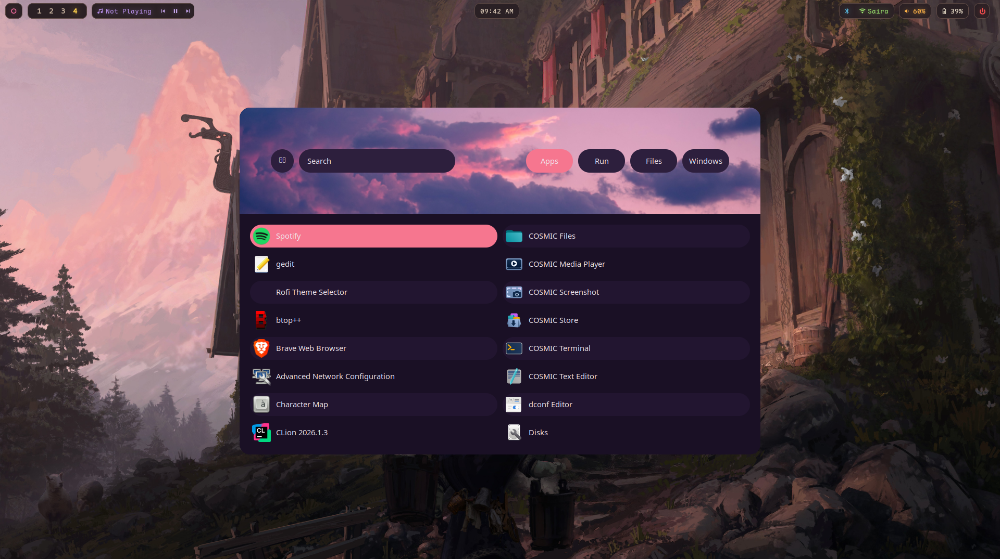
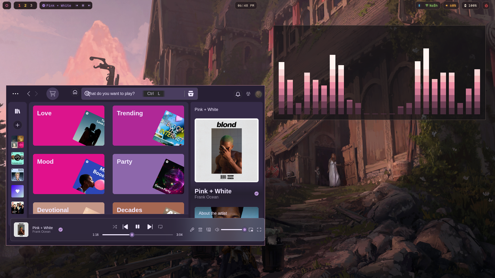
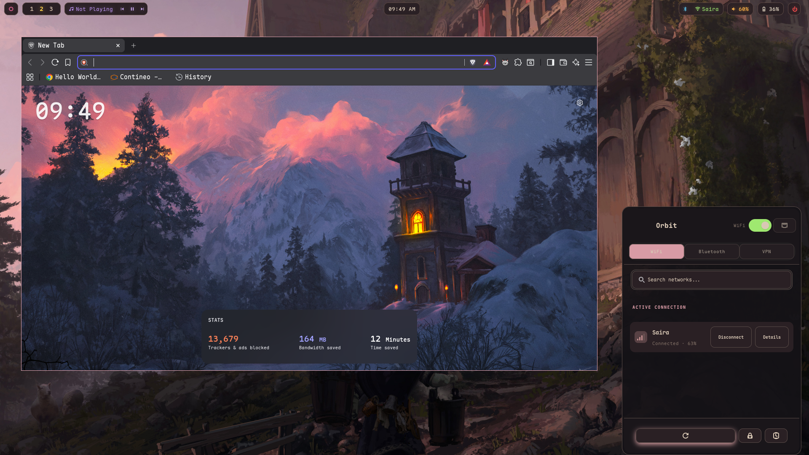
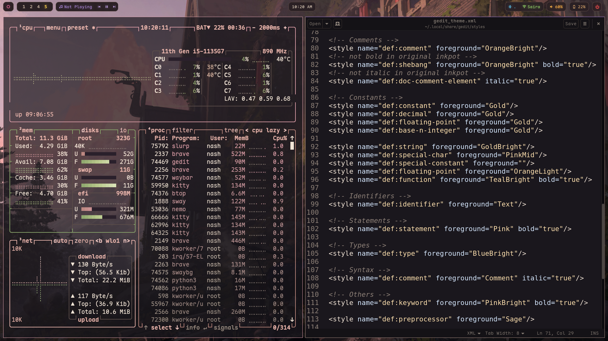
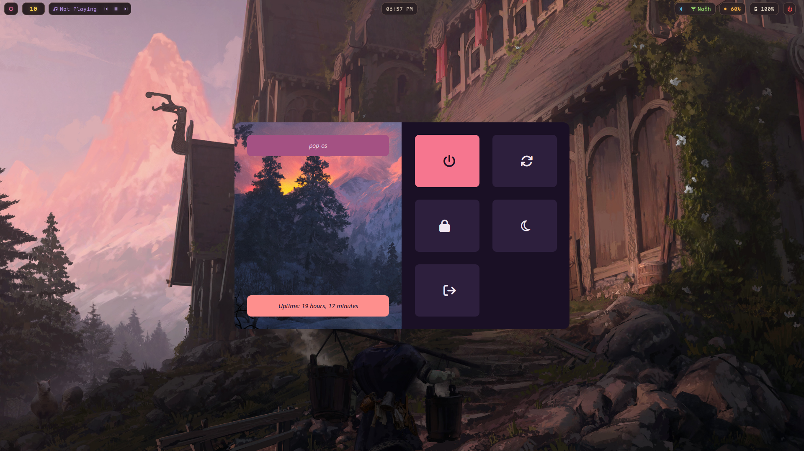

# *Soft Dawn rice*

### Cozy minimalist Rice.
I switched to Linux a few weeks ago and wanted to do something meaningful and fun and here we are. My best attempt at creating a desktop that was minimal and comfortable to use every day. Shout out to [diinki's](https://youtu.be/jFz5gLqv-FM?si=roDH6UC9dYuVbEZI) tutorial that introduced me to the world of Linux customization and gave me a solid start. 

Built on Pop!_OS 24.04 LTS. Most of the resources I followed were created for Arch-based systems, so some installation and setup steps had to be adapted along the way.

# *Screenshots*
### Fastfetch, Terminal & tty-clock


### Application Launcher


### Spotify & Cava


### Browser & Network Manager


### Btop & gedit


### Powermenu




# *Setup*
  - OS: Pop!_OS is 24.04 LTS
  - WM: Sway.(SwayFX once Pop!_OS updates wayland-server)
  - Terminal: Kitty
  - Font: Maple Mono NF [here](https://github.com/subframe7536/maple-font).
  - Bar: Waybar
  - Launcher: Rofi
  - File manager: Nemo
  - Network menu: [Orbit](https://github.com/LifeOfATitan/orbit)
  - Notification daemon: [Mako](https://github.com/emersion/mako)
  - GTK Theme: [diinki-retro-dark](https://youtu.be/jFz5gLqv-FM?si=roDH6UC9dYuVbEZI)
  - Lockscreen: Swaylock
  
## Install dependencies
 
```bash
sudo apt update \
sudo apt install sway waybar wofi kitty mako swaylock \
nemo pavucontrol brightnessctl \
grim slurp pulseaudio-utils

```
## Notes
- Check the Sway keybindings (sway/config) before using the setup.
- Clone the repository and copy the configuration files into `~/.config`.
- Make all scripts executable (`chmod +x`).
- Brightness controls and autotiling may require additional setup depending on your hardware.
- Both Rofi and Wofi launchers are included, although Rofi is the primary launcher.
- Last one, this rice is my first project so if there is anything that I can improve on, then let me know! cheers.

## Credits
 
- [diinki](https://youtu.be/jFz5gLqv-FM?si=roDH6UC9dYuVbEZI) — original ricing tutorial and `diinki-retro-dark` GTK theme.
- [Orbit](https://github.com/LifeOfATitan/orbit) - Brilliant Network manager menu.
- Coolest and my personal favorite Rice. Adopted the rofi Launcher and Powermenu from [this](https://github.com/LoneWolf4713/new-wave).
- Wallpapers are picked up from [Wallhaven](https://wallhaven.cc/) or refer from [Wallpapers](https://github.com/Nash-dot/dotfiles/tree/main/wallpapers).

